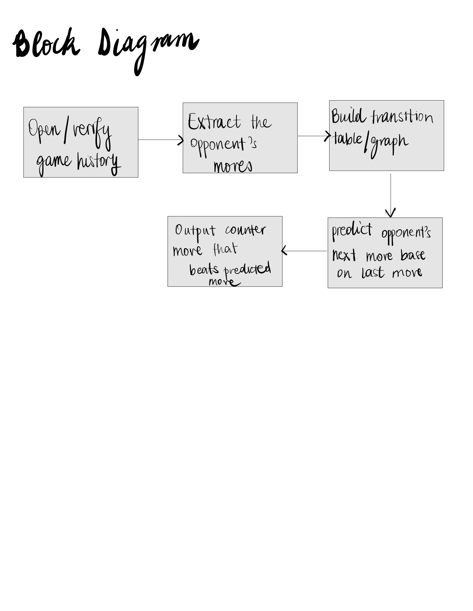

# Rock–Paper–Scissors Algorithm 
## Design 


## Analysis

The goal is to choose a move that maximizes the chance of winning based on past gameplay. Instead of playing randomly, this design assumes the opponent’s next move depends on their previous move by calculating the probability of what the next move will be.

## Data Representation

The typical moves of the game will be represented as shown below:

- Rock = 0  
- Paper = 1  
- Scissors = 2  

Each game record has the form:

```
[cpu_move, opponent_move, score]

```

but only the opponent’s moves are used in the design of this model

## Block Diagram




## Design

The algorithm works in four steps:

1. If there is insufficient history, play randomly  
2. Learn transition counts between consecutive opponent moves  
3. Predict the opponent’s next move based on their most recent move  
4. Play the move that beats the predicted move  


## Pseudocode


FUNCTION rock_paper_scissor(history):

```
IF history is None OR length(history) < 2:
    RETURN random move

INITIALIZE transition graph

FOR each consecutive pair in history:
    increment transition count

last_move = opponent’s last move
predicted_move = most frequent transition from last_move

RETURN move that beats predicted_move
```


## Plan

- Load training data  
- Build transition graph from history  
- Predict next opponent move  
- Return counter move to predicted move of the opponent


## Complexity

- Time: O(n) for training (where n is the number of rows in the history file ) 
- Space: O(1)  (the only additional space is a 3*3 probability dictionary )


## Summary

This design exploits sequential patterns in opponent behavior and is efficient, easy to interpret, and performs better than random play when patterns exist.


