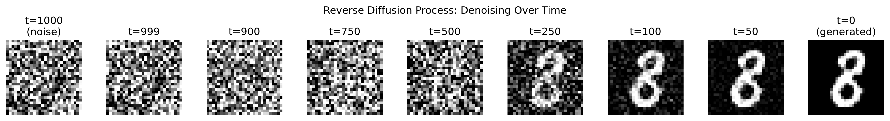
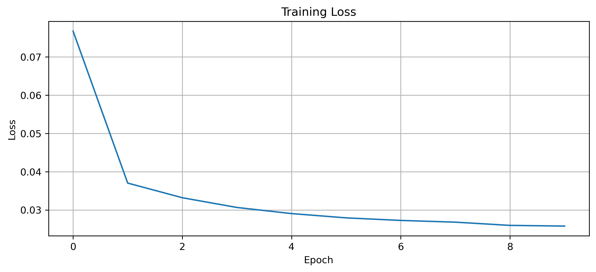

# Denoising Diffusion Probabilistic Models (DDPM) - Post Lab Write-Up

Denoising Diffusion Probabilistic Models (DDPMs) are generative models that learn to create data by reversing a gradual noising process. During the forward diffusion process, Gaussian noise is progressively added to an image over many timesteps until the image becomes nearly pure noise. The model is trained to learn the reverse process: at each timestep, it predicts the noise that was added and removes it step by step. After training, new images can be generated by starting from random noise and iteratively denoising using the learned model.

The key components of this diffusion model implementation include: (1) a noise scheduler, which defines the variance schedule (beta_t) and controls how noise is added and removed; (2) the U-Net architecture, which predicts the noise given a noisy image and timestep embedding; (3) timestep embeddings, which allow the model to condition its predictions on the current diffusion step; (4) the training objective, which minimizes mean squared error (MSE) between the predicted noise and the true noise; and (5) the sampling procedure, which iteratively denoises pure Gaussian noise to generate new images.

Below are screenshots of the generated images produced by the trained diffusion model and the corresponding training loss curve.

While doing this lab, I gained a deeper understanding of how diffusion models differ from traditional generative models like GANs and VAEs. Instead of learning to directly map noise to images in a single step, diffusion models learn a sequence of simpler denoising tasks. Implementing the training loop and sampling step helped clarify how the forward and reverse processes are mathematically connected. Overall, this lab strengthened my understanding of probabilistic generative modeling and how architectural design, such as the use of a U-Net with timestep embeddings, integrates with the diffusion framework.

The completed Jupyter Notebook containing the full implementation of the diffusion model, training procedure, and sampling process is included with this submission.
